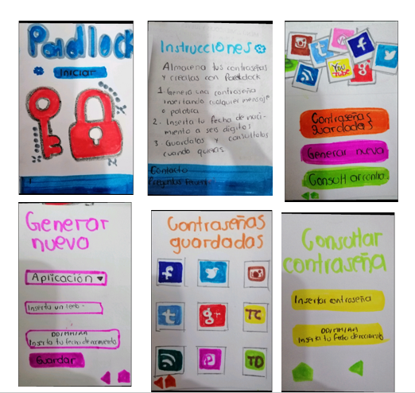
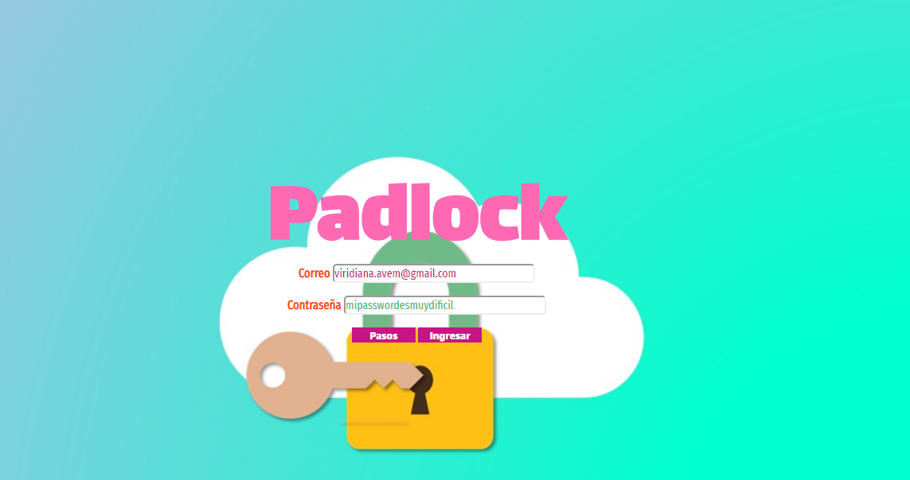
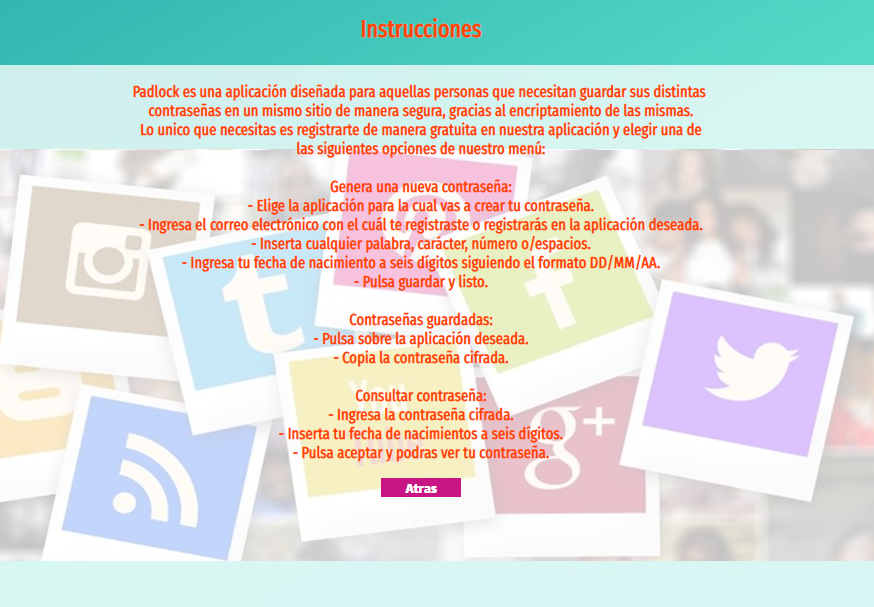
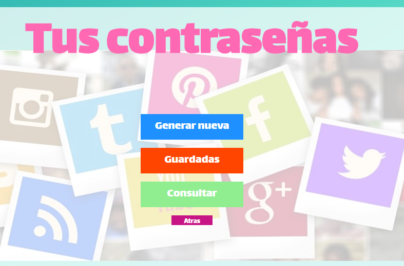
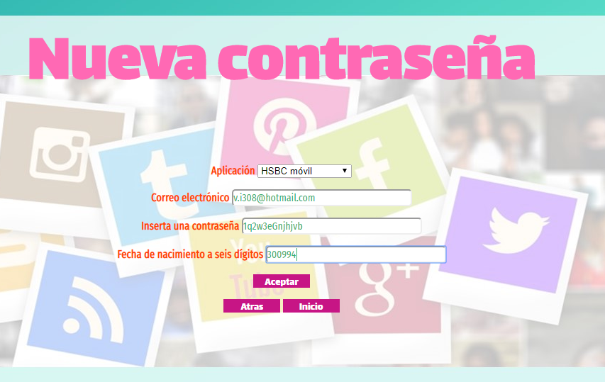
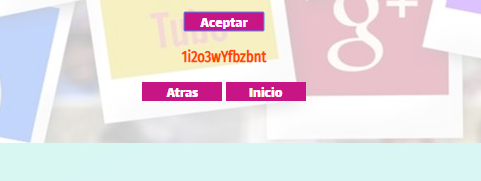
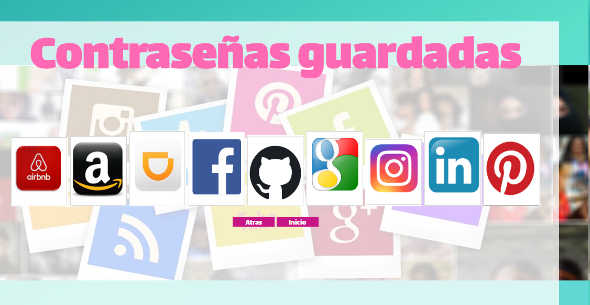
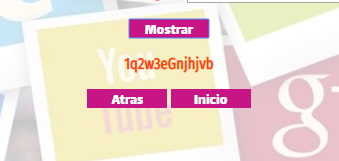

#### PADLOCK

#### Definición del producto

Padlock fue creado a partir de ubicarme a mi como un usuario con la necesidad de gestionar mis claves secretas, pues siempre olvido mis diferentes contraseñas y termino
restaurandolas o utilizando la misma para todas, lo que es muy inseguro porque si alguién intenta robarme información lo haría facilmente. Ya que sumando
a lo anterior procuro crear contraseñas fáciles de recordar lo que incrementa su vulnerabilidad.
Apartir de esto surgió la idea de crear una aplicación que por un lado de permita crear una contraseña con un gran nivel de dificultad 
y por el otro se guarde de manera cifrada.

- Prototipo

- Quiénes son los principales usuarios de producto.

Apartir de hacer un prototipo en papel y testearlo con cinco personas llegué a la conclusión de que las mujeres
eran los principales usuarios de Padlock, pues a las 3 mujeres cuestionadas les pasaba lo mismo que a mi con sus contraseñas.
Mientras que los hombres tenían varias claves que podían recordar y afirmaron que no necesitaban ni usarian una apliación
que les ayudarpa a gestionarlas. 

- Cuáles son los objetivos de estos usuarios en relación con tu producto.

Las mujeres cuestionadas buscan un lugar donde puedan tener sus claves almacenadas de manera segura, y no en las notas del cel
que pueden perder si se los roban o en alguna libreta que caiga en manos equivocadas. También quieren crear distintas contraseñas
para distintas aplicaciones pero de modo que puedan recordarlas.

- Cómo crees que el producto que estás creando está resolviendo sus problemas.

Padlock resuelve dicha problematica proque puedes crear una contraseña muy complicada y guardarla de forma cifrada
así si por error alguien entra a tu aplicación no verá la contraseña real, sino su cifrado, para el cual utilizas tu
fecha de nacimiento, por ser una numeración fácil de recordado. Si tu quieres consultar tu contraseña unicamente debes
decifrarla y así podras obtener la real. Además Padlock guarda las claves en relación a los iconos de las aplicaciones y
también puedes guardar el correo electronico con el que te has registrado en la app.

#### DESCARGA Y EJECUCIÓN DE LA APLICACIÓN

Padlock puede ser consultado desde un celular hasta en una computadora, pues al registrarte en la página tu información queda
guardada en la nube. Los pasos de uso son los siguientes.

1. Crear usuario y contraseña.

2. Consulta las instrucciones. 

3. Ve al ménu de opciones:

4. Crear una nueva clave ingresando: 
   - Nombre de aplicación.
   - Correo electrónico.
   - Cualquier palabra con cualquier letra, carácter o número que quieras como contraseña.
   - Tú feche de nacimiento a seis dígitos.
   
   
   
   - Pulsar aceptar para almacenarla.
   
   
   
5. Consultar una contraseña:
   - Ir al menú de contraseñas guardadas.
   - Dar click sobre el icono de la aplicación.
   - A continuación se desplegará la contraseña cifrada y el correo almacenado.
   
    
   
6. Consultar:    
   - Ingresa a consulta.  
   - Inserta la clave cifrada que puedes consultar o copiar en la sección anterior.
   - Insertta tu fecha de nacimiento a seis dígitos.
   
    
    
   - Pulsa guardar para ver contraseña descifrada.
   
     
     
     
#### FUNCIONALIDAD

La funcionalidad de Padlock consiste en guardar contraseñas de forma encriptada para que sólo el usuario pueda desencriptarlas
con un número que es díficil de olvidad, la fecha de nacimiento, no obstante si el usuario lo prefiere puede ser cualquier número
con n dígitos, la intención es que pueda recordarlo siempre. 

Se puede almacenar cualqueier clave, de bancos, aplicaciones, internet o cuentas tanto escolares como laborales, además puedes
incluir el correo de registro, elemento que también suele olvidarse con el paso del tiempo.
DISEÑO

Padlock al ser dirigido a un público femenino utiliza colores claros y pasteles que son agradables a la vista
y además busca que los botones o cajas de textos sean sencillos y claros para su fácil uso.
